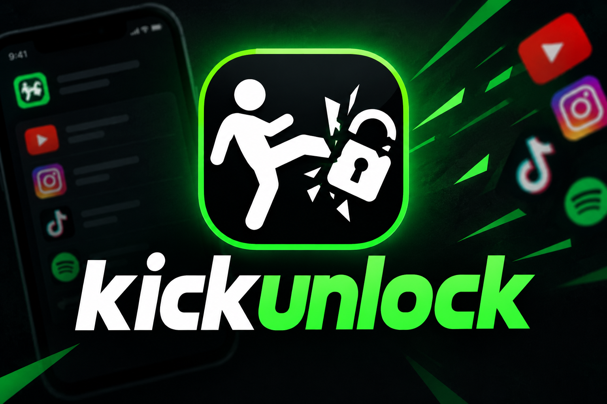
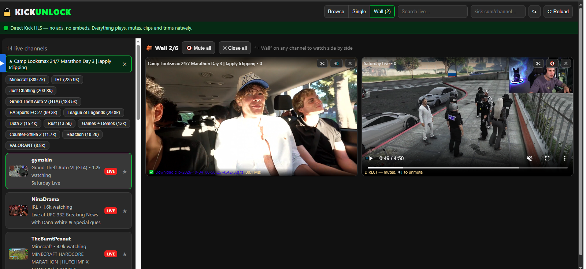
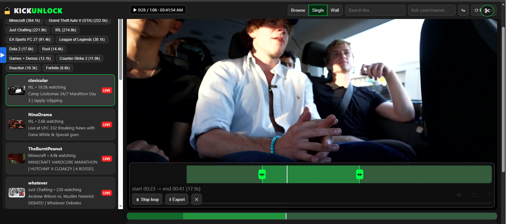

### ⬇️ [Download KickUnlock v1.0.0-alpha for Windows](https://github.com/JohnHansonTheDev/kickunlock/releases/download/v1.0.0-alpha/kickunlock-v1.0.0-alpha-win64.zip)

**Watch ANY Kick channel unlocked. No login. No ads. No limits.**

> **The clipper's edge:** the moment happens live — you're already recording
> it. One keypress grabs the last play, the trim studio loops it, and a
> share-ready `.webm` drops in seconds. No screen recorder. No re-encoding.
> No missed moments.

## ⚡ The clipping workflow

| Step | What you do | Time |
|---|---|---|
| **Find it** | Browse live channels (viewers, categories, ★ favorites) or paste any `kick.com/…` URL | seconds |
| **Watch it** | Solo player or up to **6 streams on the Wall** while you wait for the moment | — |
| **Grab it** | `✂ Record` — 10/30/60/120s of pixel-identical live edge, on any tile, mid-watch | ~clip length |
| **Cut it** | Drag the orange cursors, **loop the selection**, hover-scrub thumbnails to land the exact frame | seconds |
| **Ship it** | `⬇ Export` → `.webm` with correct duration metadata, ready to post | seconds |

Total: **moment to postable clip in under a minute** — without ever opening an
editor, and without the quality tax of screen capture.

## 🧱 Never miss an angle — the Wall

Rivals go live at the same time. Drama unfolds on two channels at once. The
Wall plays up to **6 streams side by side** (auto 1 / 2 / 3 / 2×2 / 3-column),
each with its own mute, **its own record button**, and **its own trim studio**.
Mute-all in one click, unmute only the angle that pops off.

## 🎞️ Trim studio, everywhere

Every player — solo *and* every wall tile — carries the full studio:

- **Orange cursors** on a buffered timeline: drag start/end while the video
  follows your cursor frame by frame.
- **Loop** the selection to feel the cut before you commit.
- **Hover thumbnails** on the timeline strip: see the frame *before* you jump.
- **Export** to `.webm` (VP9/Opus) with patched duration headers, so the
  progress bar behaves like a real file everywhere.

## 🎮 Built for speed

- **Hold-to-shuttle keys** — hold `Z` to rewind, hold `X` for fast-forward
  (speeds + keys remappable in ⚙, with on-screen readout).
- **Live timestamp badge** — position, seconds-behind-live, wall clock.
- **Zero re-encode recording** — byte-exact stream copy at best bitrate
  (variant-aware master playlist handling). What aired is what you keep.

## 👀 Watching

- Live directory with thumbnails, viewer counts, categories, search, favorites.
- Ad-free direct HLS: no embeds, no pop-ups, no chat spam.
- Hold-key shuttle, speed presets (0.5×–4×), theater + fit-screen modes,
  fullscreen, hover-scrub timeline (click to jump).

## 🚀 Run it

**Release zip (easiest):** [download](https://github.com/JohnHansonTheDev/kickunlock/releases/download/v1.0.0-alpha/kickunlock-v1.0.0-alpha-win64.zip),
extract anywhere, double-click **`start-kickunlock.bat`** → browser opens at
`http://localhost:3001`. Portable Node ships inside — nothing installs.

**From source:** Node 20+ — `npm install && node server.js`.

## 🛠️ Under the hood

- **Browse** — Kick's own directory API via real Chrome TLS fingerprint
  (`curl-impersonate`, vendored in `bin/`), so directory endpoints don't get
  WAF-blocked.
- **Playback** — per-channel signed HLS resolved fresh on every tune, proxied
  locally with correct referers: CORS-safe, cookie-free.
- **Stack** — Node + Express, hls.js, vanilla JS. No build step, no telemetry;
  nothing leaves your machine except Kick's own API/CDN traffic.

## ⚠️ Honest limits

- Public streams only — subscriber-only / private content is out of reach, and
  region-locked streams need a VPN on your end.
- Live edge only for recording (replays work where the stream stays up).

## 📜 License

MIT — do what you want, clips included.
